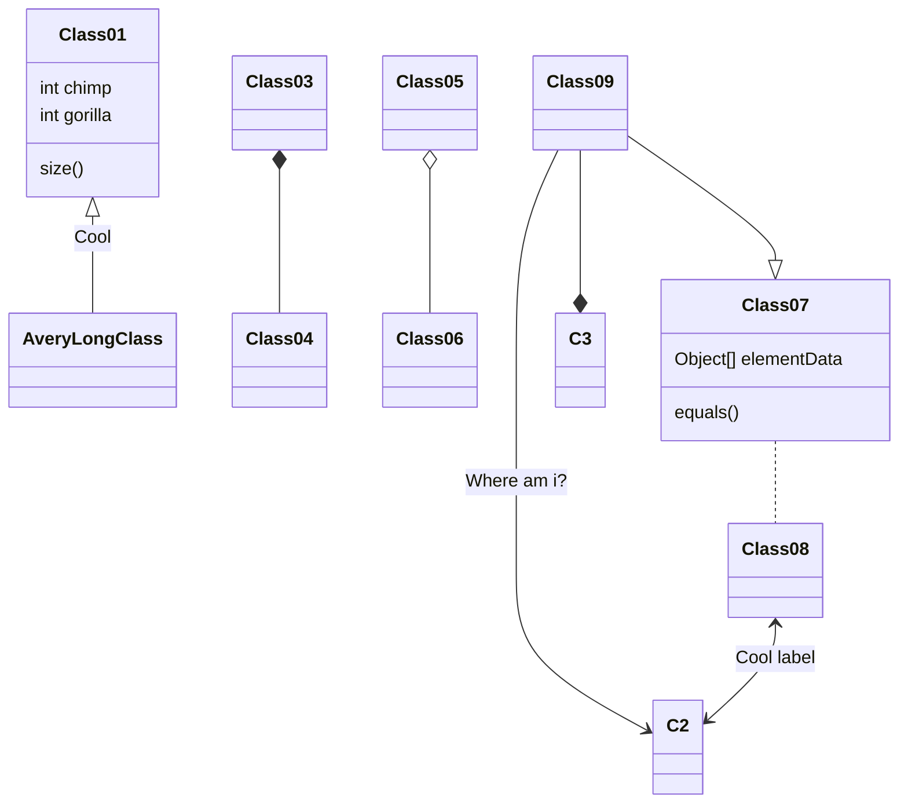

paper: []()

$ x_i $

### **Contributions**
### **Pre-proccessing**
### **Architecture**
<div align="center"></div>

<center></center>

<center> <figure class="half">
    
    
</figure> </center>

### **Features with the most important first**
### **Reducing Overfitting**
### **Training Details**

### **Discussion**

- [x] hh 
- [ ] hh


```flow
st=>start: 陪妹子进商场
op=>operation: 买买买
cond=>condition: 妹子开不开心?
e=>end: 出商场
st->op->cond
cond(yes)->e
cond(no)->op
```


